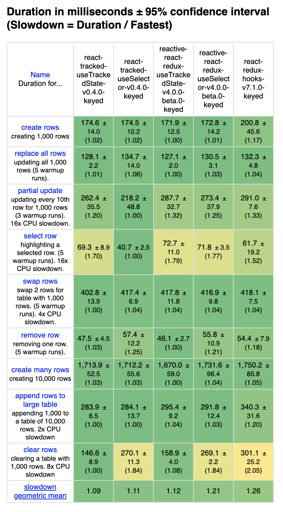
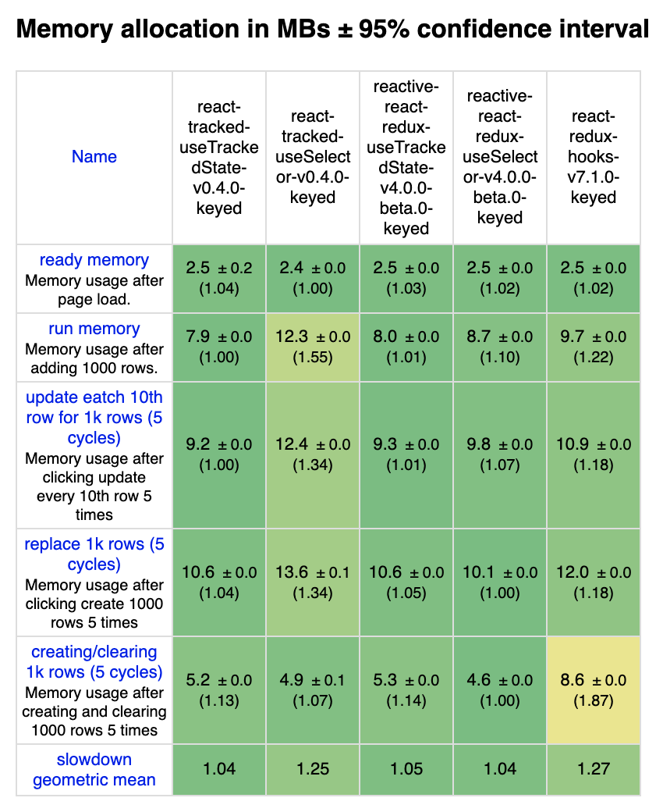

### Introduction

React-Redux provides [hooks API](https://react-redux.js.org/api/hooks)
with nice abstraction.
Especially, `useSelector` is probaly less missused than `mapStateToProps`.

[react-tracked](https://github.com/dai-shi/react-tracked)
is a library for global state without Redux.
This library provides almost compatible hooks API to React-Redux.
It's developed with performance in mind, and it should
be as performant as React-Redux, even though it utilizes
only React context. See the GitHub repo for more information.

https://github.com/dai-shi/react-tracked

This post shows benchmark results to convince that
it actually is performant in one scenario.

It's worth mentioning that react-tracked, as the name implies,
has another `useTrackedState` hook that has capability of
state usage tracking. Unlike `useSelector`, developers don't need
to define selectors for this hook.

It's also worth mentioning that another library
[reactive-react-redux](https://github.com/dai-shi/reactive-react-redux)
provides the `useTrackedState` hook for Redux.
See the GitHub repo for more information.

https://github.com/dai-shi/reactive-react-redux

We compare all hooks described above.

### Benchmark tool

To benchmark different frameworks,
[js-framework-benchmark](https://github.com/krausest/js-framework-benchmark)
is used.

Checkout [the forked repo](https://github.com/dai-shi/js-framework-benchmark/tree/55fb0b4e4a283cfc49970900b6685ea10fe5eb64)
if you want to reproduce the benchmark result at your end.

### Benchmark results

- react-tracked-useTrackedState: `useTrackedState` in react-tracked v0.4.0
- react-tracked-useSelector: `useSelector` in react-tracked v0.4.0
- reactive-react-redux-useTrackedState: `useTrackedState` in reactive-react-redux v4.0.0-beta.0
- reactive-react-redux-useSelector: `useSelector` in reactive-react-redux v4.0.0-beta.0
- react-redux-hooks: `useSelector` in react-redux v7.1.0

### Closing notes

The benchmark code for `useSelector` is almost identical
among three libraries.
The code for `useTrackedState` is also identical
between two libraries.
However, the code for `useSelector` and
the code for `useTrackedState` is a bit different
and they are optimized separately.
Hence, be reminded when comparing with different hooks.

I hope these results encourage developers to try my two libraries.
