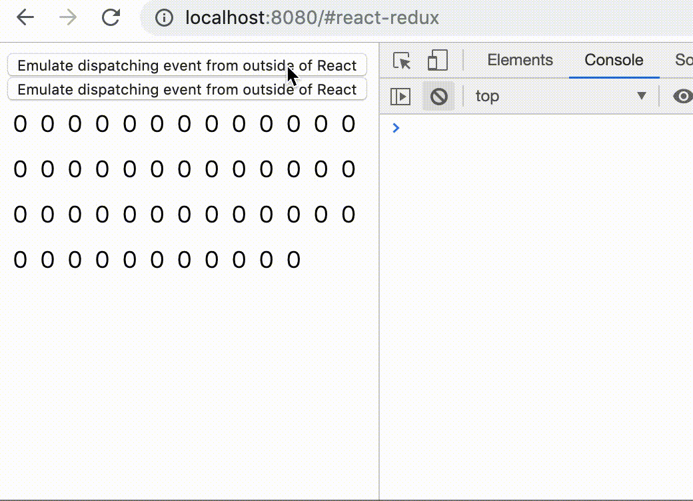

### Introduction

I have been developing several React hooks libraries for months.
In this post, I will explain why and how I developed
a React Redux binding library with React hooks.
The library is implemented to be concurrent mode friendly.
Let's discuss why it's important and what's the technique behind it.

React concurrent mode has not come yet,
and all discussions are based on the current unstable behavior.
Please note that when concurrent mode is released and
best practice is researched, things may change.

### What is Concurrent Mode

My understanding of concurrent mode is
a React render mode that can prioritize some renders over others.
In concurrent mode,
React can pause render in the middle of component tree
and throw away the partially rendered result.

Let's take simple example code.

```jsx
const ParentA = () => (
  <div>
    Hello
    <ChildA />
  </div>
);

const ChildA = () => (
  <span>World</span>
);

const ParentB = () => (
  <div>
    Hello
    {renderChildB()}
  </div>
)

const renderChildB = () => (
  <span>World</span>
);
```

Two components `ParentA` and `ParentB` would produce the same result.
There's probably no difference in sync mode (= no concurrent mode).
But, in concurrent mode, React can pause ChildA to render
after ParentA rendered.
That's not possible with `ParentB`,
because it invokes `renderChildB` immediately.

If React detects a higher priority task,
it will pause render and throw it away.
It will then do the task and restart the render again.
(Or does it continue?)

To pause render, a component has to be defined like `ParentA`.
It's not a big problem, because developers are already used to it.
But, there are other cases that developers have to care for concurrent mode.
If a component doesn't expect the pause, it may behave incorrectly.
I will describe a concrete problem with react-redux in the next section.
Before going into that, let me note there are at least two levels in a solution.

The first level is if there's a problem in concurrent mode,
it falls back in sync mode.
This is hypothetically done like `renderChildB` or
we can do the fallback with `useLayoutEffect` which runs effects in sync.
If the frequency of this fallback is very low, 
we would be able to get benefits of concurrent mode in most situations.
But if the frequency is very high, we would expect the same behavior
as in sync mode, even if we enable concurrent mode.

The second level is to make it work
fully in concurrent mode without sync mode fallback.
This would allow us to get benefits all the time.

### Problem

Now let's discuss a problem in react-redux v7.1.0.
The following is example code using `useSelector`.

```jsx
const App = () => (
  <Provider store={store}>
    <Parent />
  </Provider>
  );

const Parent = () => (
  <div>
    <Child />
    <Child />
  </div>
);

const Child = () => {
  const count = useSelector(state => state.count);
  return <span>{count}</span>
};
```

Even with this small example, there's a problem in concurrent mode.
More precisely, it may or may not be a problem depending on
the requirement of an app.

The problem is that the first `Child` and the second `Child`
may render different `count`.
This could happen in the following steps.

1. Initially, `state = { count: 1 }`
2. `Parent` renders
3. The first `Child` renders with count=1
4. An interrupting task comes which updates `state = { count: 2 }`
5. The second `Child` renders with count=2
6. State updates trigger `Child` components re-render
7. Both `Child` components render with count=2

So, there's a certain point where inconsistent `count`s appear.
What could be worse is, in a certain case when 
components re-render just before step 6,
`Child` components do not re-render with updated count at step 6.
(I hope this could be solved by removing a line in the source code.)

The reason why this happens is that
`useSelector` invokes `store.getState()` in render.
In Redux, state is immutable, but store can only have one latest version.
Hence, the result `store.getState()` is not stable over time.

The following screencast shows the inconsistency with 50 child components.



### Solution in reactive-react-redux 4.1.0

I have been developing a library called reactive-react-redux
which is an alternative to react-redux. Only hooks API is supported.

https://github.com/dai-shi/reactive-react-redux

This library solves the problem I described in the previous section.
Let me note that react-redux originally tried to solve the problem in v6.
I think it solved in a certain sense.
However, there are no way to bail out rendering with useContext,
and react-redux v6 wasn't able to support hooks API.
react-redux v7 like v5 uses store context and
subscriptions to support hooks API.

The way react-redux v6 works is that it puts store state in a context,
and it doesn't use `store.getState()` in child components.
Context can have multiple versions (snapshots) of state and the problem solved.

My library reactive-react-redux v4 solves the problem by
adding subscription mechanism to state context.
In other words, it's a mix of react-redux v6 and v7.
My library uses [an undocumented feature of calculateChangedBits](https://github.com/dai-shi/reactive-react-redux/issues/29)
to mix state context and subscriptions,
which allows optimizing render performance.

There was a performance issue in react-redux v6,
probably because it lets context propagates to all child components.
reactive-react-redux v4 stops the propagation and
its performance is very good.
[A benchmark result](https://github.com/dai-shi/reactive-react-redux/issues/32#issuecomment-513507770)
shows that it performs equally to or slightly better than react-redux v7.

### Tool to test libraries

I wasn't very confident at first
whether my library actually works in concurrent mode without the problem.
So, I developed a testing tool.
(The screencast of the previous section is by the tool.)

https://github.com/dai-shi/will-this-react-global-state-work-in-concurrent-mode

This tool has a small app to display many counts and check the inconsistency.
Here's the result with jest.

```
  react-redux
    ✓ check1: updated properly (975ms)
    ✕ check2: no tearing during update (18ms)
    ✓ check3: ability to interrupt render (1ms)
    ✕ check4: proper update after interrupt (5083ms)
  reactive-react-redux
    ✓ check1: updated properly (1448ms)
    ✓ check2: no tearing during update (3ms)
    ✓ check3: ability to interrupt render
    ✓ check4: proper update after interrupt (751ms)
```

If a library passes all four checks, it's likely that
it works in concurrent mode and get benefits from it.
The check3 is to test if a task can interrupt render.
If it falls back in sync mode, this check will fail.

My original implementation in reactitve-react-redux v4.0.0
had the issue and the check3 failed.
That was because I used `useLayoutEffect` which runs effects in sync.
reactive-react-redux v4.1.0 eliminates it and passes all the checks.

As of writing, there are not much documentation
about concurrent mode, and everything is based on observation.
That means, anything could be wrong. Please be reminded.

### Closing notes

Concurrent mode is not yet released.
So, in some sense, everything is hypothetical.
However, I found it valuable to build a testing tool,
because we then can discuss with the behavior even if it's unstable.
The behavior can be changed later,
but we can update the tool to follow the change.

So, the primary goal of this post is to encourage
people to try out the tool and give feedback.

The secondary goal is to inform the technique I did
in reactive-react-redux.
There could still be more rooms for improvement and fix.
So, feedback is welcome too.

Lastly, I developed some other libraries with the same technique.

https://github.com/dai-shi/react-tracked

react-tracked provides the same hooks API as in reactive-react-redux without redux.

https://github.com/dai-shi/use-context-selector

use-context-selector provides `useContextSelector` hook in userland.

----

Hope you enjoyed the post.
