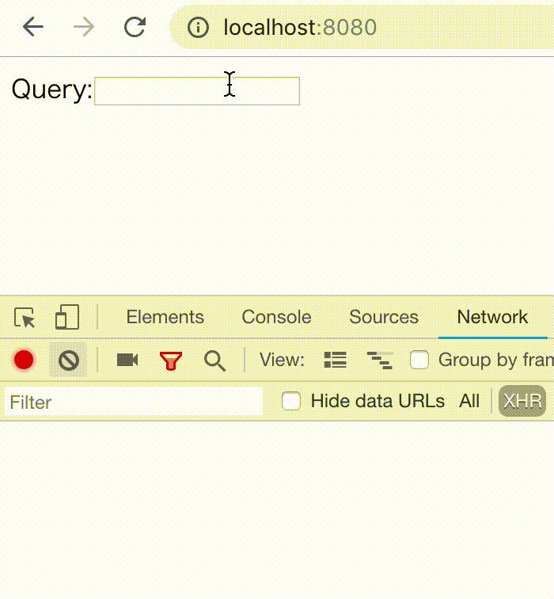

> There is a follow-up article which describes the implementation details of the library. Please visit [here](https://blog.axlight.com/posts/developing-react-custom-hooks-for-abortable-async-functions-with-abortcontroller/).

### TL;DR

Just visit the [example](https://codesandbox.io/s/github/dai-shi/react-hooks-async/tree/master/examples/04_typeahead) in codesandbox and try it.

### Background

You can't cancel promises in JavaScript and that's one of the reason why libraries such as redux-saga and redux-observables are popular because they allow cancellation. While they are good solutions as well as Redux is, there might be a case when you want just a cancellation mechanism for a promise, not the entire framework. As is noted JavaScript doesn't have cancellation mechanism, but DOM has it. It's called [AbortController](https://developer.mozilla.org/en-US/docs/Web/API/AbortController). It's only supported in recent browsers, but polyfills should help for old browsers and Node.js.

----

React Hooks API is a new feature coming soon in React 16.7. You can create a custom hook to share logic across components. Hooks are just functions and you can compose them easily. There has been many of proposals for custom hooks, including handling async functions. To my knowledge, there has been no proposal for abortable async functions. If we could use abortable async functions easily with hooks, it would be useful for small use cases where introducing big frameworks is not a good option.

----

In this article, we take a use case to illustrate how it can be implemented in hooks. We don't go deep in the library implementation, rather focus on the usage of it to understand how it is acceptable. The use case is so-called "typeahead search" where you have a textbox in which you can type, and as you type a search query, the search result is shown on the fly. There are three difficulties in this use case; a) we have to deal with async side effect in hooks, b) we need to abort a previous incomplete search which is no longer valid, and c) we want a delay before starting a search to reduce the number of network requests.

### Hooks to handle async functions

Now, let's look into hooks to handle abortable async functions. The first is a hook to create an async task.

```javascript
const task = useAsyncTask(func, inputs);
```

`func` is a function with an argument which is AbortController. This function returns a promise, but the function is responsible to cancel the promise by AbortController. It's just a rule of this hook. No magic. `inputs` is an array of inputs just like the second argument of `useEffect`. This controls when to create an async task. This is surely tricky, but let's assume developers are already used to using the second argument of `useEffect`. The `task` returned by this hook contains information about the state of the task and you can destructure it easily: `const { pending, error, result } = task;`

----

The second hook is to run an async task created by the first hook above.

```javascript
useAsyncRun(task);
```

This starts an async task just once. However, that doesn't mean only one async task will run. As described above, we can control creating async tasks by `inputs`, hence eventually it runs several async tasks. The important part of `useAsyncRun` is that it automatically aborts a previous task if it's not yet finished. You can pass a falsy value to the argument of `useAsyncRun` by which you can control when to start an async task.

----

The core hooks are just the above two, but we want another hook for our use case. The third hook is to combine several async tasks sequentially.

```javascript
const combinedTask = useAsyncCombineSeq(task1, task2);
```

The `combinedTask` returned by this hook contains the information about the state of the combined task, but for `result`, it should be easier and type-safe to read it from each tasks instead.

----

While `useAsyncTask` is sufficient to create an async task, it's not trivial to write a `func` with the rule that it needs to handle AbortController. Hence, we provide two helper hooks that wrap `useAsyncTask`.

```javascript
const task1 = useAsyncTaskTimeout(func, delay);
const task2 = useAsyncTaskFetch(url);
```

`useAsyncTaskTimeout` is just to wait a certain amount of time and then run `func`.

`useAsyncTaskFetch` is to fetch JSON data from `url`. You can also use "POST" method and fetch non-JSON data with options.

### The use case example

It's time to code and run the use case. We use GitHub repository search. In this use case example, as you type a query string, it will show the search result.



Here is the code to realize this example. For the concrete code in TypeScript, visit the [example](https://codesandbox.io/s/github/dai-shi/react-hooks-async/tree/master/examples/04_typeahead) in codesandbox or the [repository](https://github.com/dai-shi/react-hooks-async) in GitHub.

```jsx
const GitHubSearch = ({ query }) => {
  const url =
    `https://api.github.com/search/repositories?q=${query}`;
  const timeoutTask = useAsyncTaskTimeout(
    useCallback(() => true, [query]),
    500,
  );
  const fetchTask = useAsyncTaskFetch(url);
  const combinedTask = useAsyncCombineSeq(timeoutTask, fetchTask);
  useAsyncRun(query && combinedTask);
  if (!query) return null;
  if (timeoutTask.pending) return <div>Waiting...</div>;
  if (fetchTask.error) return <Err error={fetchTask.error} />;
  if (fetchTask.pending) return <Loading abort={fetchTask.abort} />;
  return (
    <ul>
      {fetchTask.result.items.map(({ id, name, html_url }) => (
        <li key={id}>
          <a target="_blank" href={html_url}>{name}</a>
        </li>
      ))}
    </ul>
  );
};

const App = () => {
  const [query, setQuery] = useState('');
  return (
    <div>
      Query:
      <input
        value={query}
        onChange={e => setQuery(e.target.value)}
      />
      <GitHubSearch query={query} />
    </div>
  );
};
```

Some notes for the code:

1. The first argument of `useAsyncTaskTimeout` is one of the trickiest one. Because the hook uses input identity to create an async task, you need to memoize it to control it. We use `useCallback` in this case. Note that the return value of the first argument function is not important here.
2. We use `query &&` in the first argument of `useAsyncRun`. This is to prevent running an async task when `query === ''`, and we don't render anything by `if (!query) return null;`.
3. `timeoutTask.pending` represents the waiting phase of 500ms delay, whereas `fetchTask.pending` represents the networking phase. Unfortunately, we can't distinguish the connecting phase and the transferring phase within the networking phase.
4. You can manually abort the fetch task by pressing a button in `<Loading abort={fetchTask.abort} />` whose code is not shown in this article.

Check out how it's working in the demo.

[react-hooks-async-example - CodeSandbox](https://codesandbox.io/s/github/dai-shi/react-hooks-async/tree/master/examples/04_typeahead?module=%2Fsrc%2FGitHubSearch.tsx)

### The library

If you are interested, please check out the library. We are still not sure how this is acceptable, and would like to hear various feedbacks, including custom hooks design, use cases, implementation issues, and so on. Please drop me a note by Twitter and GitHub issues.

https://github.com/dai-shi/react-hooks-async

### Final notes

I hesitated a bit before starting developing this idea, because in the React roadmap, we are expecting Suspense and react-cache in the near future. This will change a lot in data fetching in general.

Well, at the point of writing, Suspense and react-cache aren't here yet. Neither is hooks, though. Hooks without Suspense may or may not play a role in data fetching for a certain use case. We will see.
