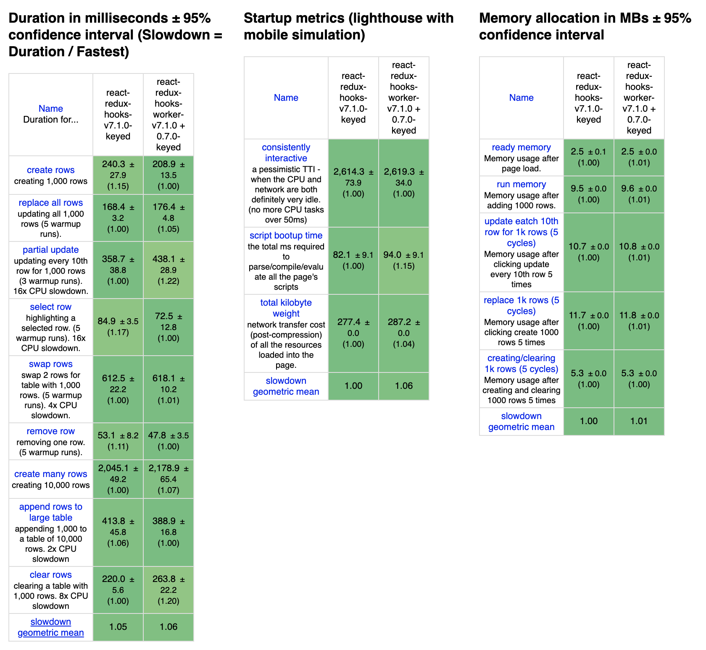

### Introduction

It is said that Redux has been overused in some use cases
and React context+hooks plays well in such use cases.
While I agree with it, Redux should work well in some other situations.
Redux should help developing larger apps with many developers.
Various libraries in Redux ecosystem should accelerate development.
There's another situation in which Redux may help, and that is Web Workers.

A while back, Surma posted a nice blog post:
[React + Redux + Comlink = Off-main-thread](https://dassur.ma/things/react-redux-comlink/)

Redux itself is independent from the UI thing,
it should be easy and reasonable to run Redux in a web worker.
The blog post shows the proof-of-concept code with [comlink](https://github.com/GoogleChromeLabs/comlink).

However, this PoC code doesn't perform well with React.
Let me quote a note from the blog post.

> Note: It was [pointed out to me on Twitter](https://twitter.com/nejcramovs/status/1156234576093687813) that by moving Redux to a worker every state change will cause the creation of a new copy due to structured cloning. This can be bad as it will cause React to rerender the entire app instead of just the elements whose state properties that have changed. While I didn't solve this problem in _this_ blog post, I did talk about a solution in my [previous blog post](https://dassur.ma/things/is-postmessage-slow/) in the "Patching" section.

I was so interested in fixing this problem that I can't help myself stopping developing a new library.

### Redux-in-Worker

My library is called "redux-in-worker."
There are so many similar libraries in npmjs.com.
I hope this library name makes sense.

<https://github.com/dai-shi/redux-in-worker>

It works as a simple wrapper to a Redux store.

In your worker file, you create and expose a store like this:

```javascript
// store.worker.js

import { createStore } from 'redux';
import { exposeStore } from 'redux-in-worker';

const reducer = ...;
const store = createStore(reducer);

exposeStore(store);
```

In your app file, you wrap the worker to get a normal store.

```jsx
// app.js

import React from 'react';
import { Provider } from 'react-redux';
import { wrapStore } from 'redux-in-worker';

const initialState = ...;
const worker = new Worker('./store.worker', { type: 'module' });
const store = wrapStore(worker, initialState);

const App = () => (
  <Provider store={store}>
    ...
  </Provider>
);
```

There's one caveat that you need to explicitly specify `initialState`.
This is because the worker acts asynchronously and we need the initialState
before the worker becomes ready and pushes the real initialState.

For those who are interested in the implementation,
I encourage them to read the source code which is rather small.

There are some notes to clarify the implementation details:

- I didn't use comlink because Redux is not RPC
  and it is basically asynchronous by nature.
- I didn't use immer-like patches because it may not work in edge cases
  and we don't need it as we can depend on Redux's immutability contract.
- Hence, there's no proxies involved, and the implementation is very simple.

The current implementation should be performant enough
thanks to the immutability.
Proxy-based implementation might or might not perform better,
but we will see it in the future if someone is interested.

### Benchmark

Now, that brings us to benchmarking.

We use [js-framework-benchmark](https://github.com/krausest/js-framework-benchmark).
There's already a benchmark "react-redux-hooks" and I converted it
with redux-in-worker as "react-redux-hooks-worker."

Here's the result.



At a glance, there's little difference.
It is very good because it means
the overhead of diffing, postMessage, and patching
is comparably low in this scenario.

You may notice "script bootup time" increases a bit.

Interestingly, "creating 1,000 rows" is faster with redux-in-worker,
and "creating 10,000 rows" is slower obviously.
(I have [another experiment](https://github.com/dfbaskin/redux-web-worker-example/pull/3) which shows creating many items slows down.)

### Closing notes

Off-main-thread Redux is relatively easy,
but there are some hurdles in practice when it comes to React Redux.
The most notable one would be `redux-thunk`
which is often used in many React Redux apps and Redux Starter Kit.
Because we can't dispatch functions to a worker,
thunks simply don't work.
Another difficulty is DOM-based middleware, such as connected-react-router.
Personally, I would suggest to move DOM-related state
from Redux to React local state or context.
But that won't happen overnight, and there're so many existing apps
and best practices.

Lastly, in terms of off-main-thead React Redux,
the portion of Redux is typically smaller than React.
There has been several experiments for off-main-thread
React renders, which I think is a very interesting idea.
But it is not trivial. I don't know if any of them reach
the point to work practically. As a final note,
React team seems to push concurrent mode rather than web workers.
