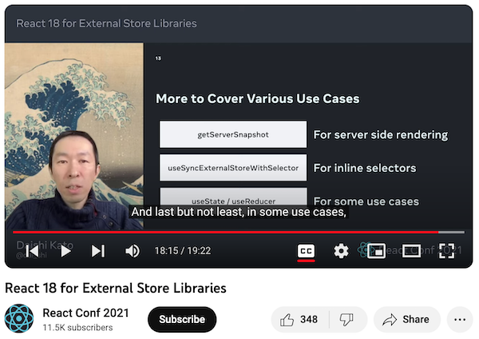

## Introduction

[Jotai](https://github.com/pmndrs/jotai) is developed to solve an extra re-render issue with React Context. A major challenge in its development has been the support of both Suspense and Concurrent rendering. Otherwise, it would have been a simpler implementation and its implementation would closely resemble that of any observable-like libraries.

As of writing, Jotai is fully compatible with Suspense and Concurrent rendering with some exceptions. There's a repo to evaluate some details.

<https://github.com/dai-shi/will-this-react-global-state-work-in-concurrent-rendering>

But, in this post, we focus on two things; tearing and time slicing.

React 18 introduces `useSyncExternalStore` hook. This is a solution for external stores to avoid tearing. Jotai is technically an external store and suffers from tearing. However, useSyncExternalStore isn't a silver bullet. It's not named as `useExternalStore`. As I understand, the "Sync" part basically means it's incompatible with "time slicing" and it's also refered as "de-opt".

We knew it while introducing the useSyncExternalStore hook. In my talk at React Conf 2021, there's a mention that "useState is sometimes desirable (more than useSyncExternalStore)". It refers to the time slicing, but it's not very clear unfortunately. The purpose of the talk is to introduce the new hook, and didn't spend time on the benefit of `useState`.

[Check out the talk](https://youtu.be/oPfSC5bQPR8?si=j334UcLLC7y4keip&t=1095) if you are interested.

This subtle difference is why Jotai uses useState (useReducer).

## What's the actual issue

The difference between 1) a userland solution with useState (useReducer) & useEffect, and 2) useSyncExternalStore, is temporary tearing. With the userland solution, it can tear for a short period of time, and then it will be consistent afterwards.

Someone posted a reproduction in the Jotai GitHub Discussions.

<https://github.com/pmndrs/jotai/discussions/2137>

You can check it out: <https://codesandbox.io/s/2pfr7t>

## What's more important than temporary tearing

As noted, Jotai supports Suspense and Concurrent rendering, specifically the use of `useTransition`. Moreover, the API is designed to be used with `useTransition`, like it doesn't have a pending state.

Zustand, which uses `useSyncExternalStore`, has a behavioral issue with `useTransition`.

Check out the demo:
<https://codesandbox.io/s/9ss9r6>

The expected behavior is to show "Pending...", but it doesn't, and instead show the Suspense fallback.

Zustand is explicitly designed as an external store, so this is somewhat acceptable.

On the other hand, Jotai is modeled after `useState` and we expect `useTransition` to behave likewise. This is more important than temporary tearing.

Ideally, if React provides a building-block function to allow creating a custom useState-like hook (that requires state versioning), Jotai can do it better. It's very unlikely that it will happen. So, it's a trade-off.

## Closing notes

When I started developing Jotai, not many people cared about Suspense and Concurrent rendering. It's nice to see recently people are interested in it and discuss on it.

This applies to Zustand and I developed another library that with useState (useReducer) instead of useSyncExternalStore.

<https://github.com/dai-shi/use-zustand>

There's also Valtio version.

<https://github.com/dai-shi/use-valtio>

By the way, you may have noticed that I refered to it as "useState (useReducer)". I actually use `useReducer` instead of `useState`. There's another reason but it's out of the scope of this post. For someone interested, you will see, if you implement it with `useState`, some of Jotai tests fail.
